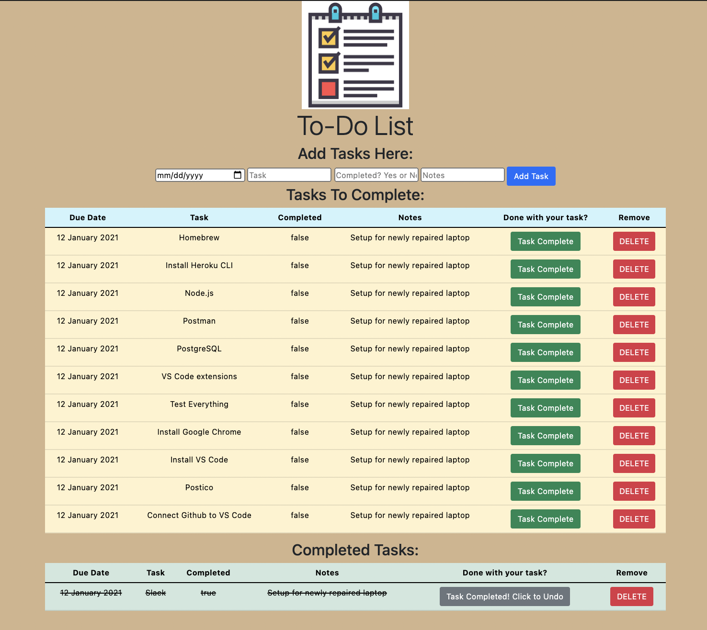

# jQuery To-Do-List w/ SQL

_Duration: 2-day weekend challenge_

## Description

To-Do-List is an app that allows the user to create tasks, mark them as completed or not completed, and remove them from the list. All tasks are stored on a database until deleted by the user. Completed tasks will have a green background, and a yellow button to re-mark them as not complete.

## Screenshots

### Prerequisites

- [Node.js](https://nodejs.org/en/)
- [Postico](https://eggerapps.at/postico/)

## Built With

HTML 5, CSS 3, Javascript, jQuery 3.5, Bootstrap 5, Node.js, Express, PostgreSQL

## Acknowledgement
Thanks to [Prime Digital Academy](http://www.primeacademy.io) who equipped and helped me to make this application.

Special thanks to my instructor: Dane Smith

## Questions? I would love to connect!
Email me at - [radichel.collin@gmail.com](mailto:radichel.collin@gmail.com)
OR
Send me a message on [LinkedIn](https://www.linkedin.com/in/collin-radichel/)
